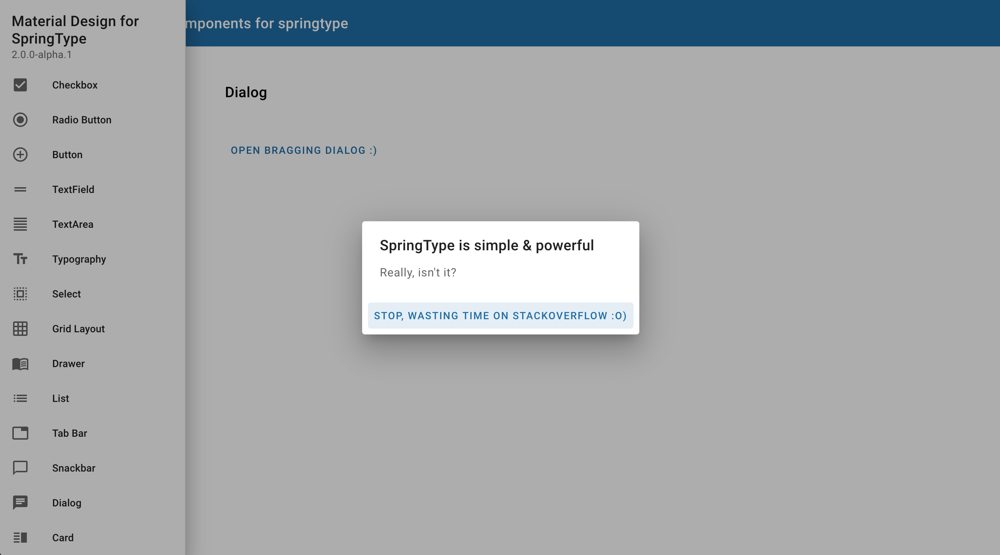
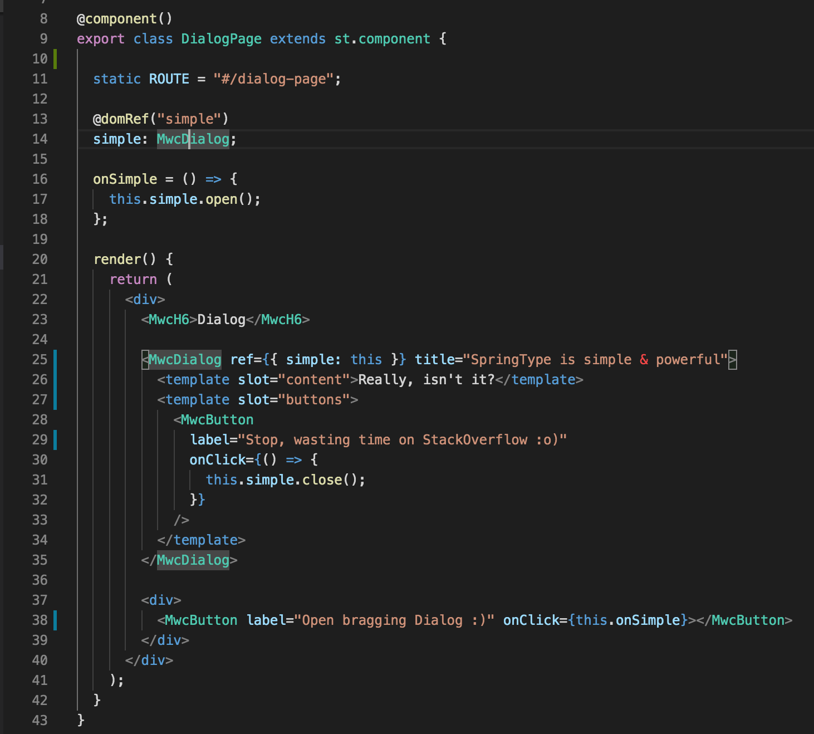

<h1 align="center">Material Design for SpringType</h2>

> Easy to use, flexible, versatile and high performant components to build websites and PWA's
> Based on the official Google Material Design implementation: material.io

<h2 align="center">Setup</h2>

    yarn add st-material

<h2 align="center">What can you expect?</h2>

A very concise API:

This is the whole code necessary to display 
the fully-interactive page in the screenshot.

<h2 align="center">Short-term Roadmap</h2>

We're keen to improve this implementation until we feel really comfortable with it. Right now this lacks:

- [ ] The full implementation of all official components

<h2 align="center">Maintainers</h2>

<table>
  <tbody>
    <tr>
      <td align="center">
        
         
        <a href="https://github.com/kyr0">Aron Homberg</a>
      </td>
      <td align="center">
        
         
        <a href="https://github.com/mansi1">Michael Mannseicher</a>
      </td>
    </tr>
  <tbody>
</table>

<h2 align="center">Contributing</h2>

Please help out to make this project even better and see your name added to the list of our  
[CONTRIBUTORS.md](./CONTRIBUTORS.md) :tada: